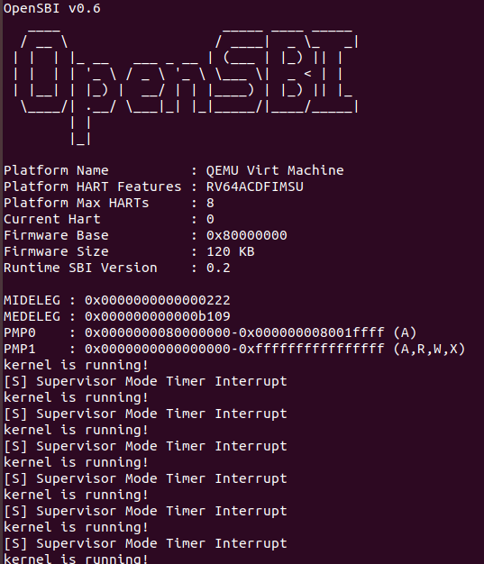
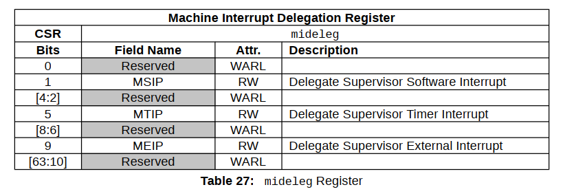

<h4 align = "center">课程名称：                     操作系统</h4>

<h4 align = "center">姓名：                     何瑞桓 周琪东</h4>

<h4 align = "center">学院：  竺可桢学院</h4>

<h4 align = "center">专业：                     计算机科学与技术</h4>

<h4 align = "center">学号：  3190101928 3190106231</h4>

<h4 align = "center">指导老师：                    季江民</h4>


<h3 align = "center">2021年11月16日</h3>

<div style="page-break-after:always"></div>

<h1 align = "center">浙江大学实验报告</h1>

<h1 align = "center">Rinux 时钟中断处理</h1>

# 一、实验内容

## 1. 准备工程

* 此次实验基于 lab1 同学所实现的代码进行。
* 在 `lab1` 中我们实现的 `puti` `puts` 使用起来较为繁琐，因此在这里使用课程提供的简化版的 `printk`。 从 `repo` 同步以下代码: `stddef.h` `printk.h` `printk.c`，并按如下目录结构放置。**还需要将之前所有 `print.h puti puts` 的引用修改为 `printk.h printk`**。

```
.
├── Makefile
├── arch
├── include
│   ├── printk.h
│   ├── stddef.h
│   └── types.h
├── init
└── lib
    ├── Makefile
    └── printk.c
```

- 修改 `vmlinux.lds` 以及 `head.S`

```asm
<<<<<<<<<<<<<<<<<<<<<<<<<<<<<<<< 原先的 vmlinux.lds
...

.text : ALIGN(0x1000){
    _stext = .;

    *(.text.entry)
    *(.text .text.*)
    
    _etext = .;
}

...

>>>>>>>>>>>>>>>>>>>>>>>>>>>>>>>> 修改之后的 vmlinux.lds
...

.text : ALIGN(0x1000){
    _stext = .;

    *(.text.init)      <- 加入了 .text.init
    *(.text.entry)     <- 之后我们实现 中断处理逻辑 会放置在 .text.entry
    *(.text .text.*)
    
    _etext = .;
}

...
```

```asm
<<<<<<<<<<<<<<<<<<<<<<<<<<<<<<<< 原先的 head.S
extern start_kernel

    .section .text.entry        <- 之前的 _start 放置在 .text.entry section       
    .globl _start
_start:
    ...

    .section .bss.stack
    .globl boot_stack
boot_stack:
    .space 4096

    .globl boot_stack_top
boot_stack_top:

>>>>>>>>>>>>>>>>>>>>>>>>>>>>>>>> 修改之后的 head.S
extern start_kernel

    .section .text.init         <- 将 _start 放入.text.init section 
    .globl _start
_start:
    ...

    .section .bss.stack
    .globl boot_stack
boot_stack:
    .space 4096

    .globl boot_stack_top
boot_stack_top:
```

## 2. 开启异常处理

在运行 `start_kernel` 之前，我们要对上面提到的 CSR 进行初始化，初始化包括以下几个步骤：

1. 设置 `stvec`， 将 `_traps` ( `_trap` 在 4.3 中实现 ) 所表示的地址写入 `stvec`，这里我们采用 `Direct 模式`, 而 `_traps` 则是中断处理入口函数的基地址。
2. 开启时钟中断，将 `sie[STIE]` 置 1。
3. 设置第一次时钟中断，参考 `clock_set_next_event()` ( `clock_set_next_event()` 在 4.5 中介绍 ) 中的逻辑用汇编实现。
4. 开启 S 态下的中断响应， 将 `sstatus[SIE]` 置 1。

将 `_start`修改如下

```asm
.extern start_kernel
    .section .text.init
    .globl _start
_start:
    # ------------------
    # - your code here -
    # set stvec = _traps
    la t0, _traps
    csrrw x0, stvec, t0
    # ------------------
    # set sie[STIE] = 1
    li t0, 0x00000020
    csrrs x0, sie, t0
    # ------------------
    # set first time interrupt
    call clock_set_next_event
    # ------------------
    # set sstatus[SIE] = 1
    li t1, 0x00000002
    csrrs x0, sstatus, t1
    # ------------------
    # ------------------
    # - your lab1 code -
    # ------------------
    la sp, boot_stack
    call start_kernel
    # ------------------

    .section .bss.stack
    .globl boot_stack
boot_stack:
    .space 4096 # <-- change to your stack size

    .globl boot_stack_top
boot_stack_top:
```

但是这样按照模板的修改是存在问题的，虽然并不会影响本次实验，但我们仍会在讨论与心得中进行讨论。

## 3. 实现上下文切换

我们要使用汇编实现上下文切换机制， 包含以下几个步骤：

1. 在 `arch/riscv/kernel/` 目录下添加 `entry.S` 文件。
2. 保存CPU的寄存器（上下文）到内存中（栈上）。
3. 将 `scause` 和 `sepc` 中的值传入异常处理函数 `trap_handler`  ，我们将会在 `trap_handler` 中实现对异常的处理。
4. 在完成对异常的处理之后， 我们从内存中（栈上）恢复CPU的寄存器（上下文）。
5. 从 trap 中返回。

将entry.s修改如下

```asm
    .section .text.entry
    .align 2
    .globl _traps
_traps:
    # YOUR CODE HERE
    # -----------
    # 1. save 32 registers and sepc to stack
    sd x1, 0(x2)
    sd x2, -8(x2)
    sd x3, -16(x2)
    sd x4, -24(x2)
    sd x5, -32(x2)
    sd x6, -40(x2)
    sd x7, -48(x2)
    sd x8, -56(x2)
    sd x9, -64(x2)
    sd x10, -72(x2)
    sd x11, -80(x2)
    sd x12, -88(x2)
    sd x13, -96(x2)
    sd x14, -104(x2)
    sd x15, -112(x2)
    sd x16, -120(x2)
    sd x17, -128(x2)
    sd x18, -136(x2)
    sd x19, -144(x2)
    sd x20, -152(x2)
    sd x21, -160(x2)
    sd x22, -168(x2)
    sd x23, -176(x2)
    sd x24, -184(x2)
    sd x25, -192(x2)
    sd x26, -200(x2)
    sd x27, -208(x2)
    sd x28, -216(x2)
    sd x29, -224(x2)
    sd x30, -232(x2)
    sd x31, -240(x2)
    csrr t0, sepc
    sd t0, -248(x2)
    addi x2, x2, -256

    # -----------
    # 2. call trap_handler
    csrr a0, scause
    csrr a1, sepc
    call trap_handler
    # -----------
    # 3. restore sepc and 32 registers (x2(x2) should be restore last) fromstack


    addi x2, x2, 256
    ld t0, -248(x2)
    csrw sepc, t0
    ld x1, -0(x2)
    ld x3, -16(x2)
    ld x4, -24(x2)
    ld x5, -32(x2)
    ld x6, -40(x2)
    ld x7, -48(x2)
    ld x8, -56(x2)
    ld x9, -64(x2)
    ld x10, -72(x2)
    ld x11, -80(x2)
    ld x12, -88(x2)
    ld x13, -96(x2)
    ld x14, -104(x2)
    ld x15, -112(x2)
    ld x16, -120(x2)
    ld x17, -128(x2)
    ld x18, -136(x2)
    ld x19, -144(x2)
    ld x20, -152(x2)
    ld x21, -160(x2)
    ld x22, -168(x2)
    ld x23, -176(x2)
    ld x24, -184(x2)
    ld x25, -192(x2)
    ld x26, -200(x2)
    ld x27, -208(x2)
    ld x28, -216(x2)
    ld x29, -224(x2)
    ld x30, -232(x2)
    ld x31, -240(x2)
    ld x2, -8(x2)
    # -----------
    # 4. return from trap
    sret
    # -----------
```

## 4. 实现异常处理函数

1. 在 `arch/riscv/kernel/` 目录下添加 `trap.c` 文件。
2. 在 `trap.c` 中实现异常处理函数 `trap_handler()`, 其接收的两个参数分别是 `scause` 和 `sepc` 两个寄存器中的值。

```asm
#include "printk.h"
#include "clock.h"
void trap_handler(unsigned long scause, unsigned long sepc) {
    // 通过 `scause` 判断trap类型
    // 如果是interrupt 判断是否是timer interrupt
    // 如果是timer interrupt 则打印输出相关信息, 并通过 `clock_set_next_event()` 设置下一次时钟中断
    // `clock_set_next_event()` 见 4.5 节
    // 其他interrupt / exception 可以直接忽略

    // YOUR CODE HERE

    long scause_1 = (long)scause;
    if(scause_1 < 0) {
        if (scause == 0x8000000000000005) {
            printk("[S] Supervisor Mode Timer Interrupt\n");
            clock_set_next_event();
        }
    }

}
```

## 5. 实现时钟中断相关函数

1. 在 `arch/riscv/kernel/` 目录下添加 `clock.c` 文件。
2. 在 `clock.c` 中实现 get_cycles ( ) : 使用 `rdtime` 汇编指令获得当前 `time` 寄存器中的值。
3. 在 `clock.c` 中实现 clock_set_next_event ( ) : 调用 `sbi_ecall`，设置下一个时钟中断事件。

```c
//
// Created by h3root on 10/29/21.
//
// clock.c

// QEMU中时钟的频率是10MHz, 也就是1秒钟相当于10000000个时钟周期。
#include "clock.h"
#include "sbi.h"
unsigned long TIMECLOCK = 10000000;

unsigned long get_cycles() {
    // 使用 rdtime 编写内联汇编，获取 time 寄存器中 (也就是mtime 寄存器 )的值并返回
    unsigned long res;
    __asm__ volatile(
    "rdtime a1\n"
    "mv %[ret0], a1\n"
    : [ret0] "=r"(res)
    :
    : "memory"
    );
    return res;
}

void clock_set_next_event() {
    // 下一次 时钟中断 的时间点
    unsigned long next = get_cycles() + TIMECLOCK;
    sbi_ecall(0x0, 0x0, next, 0, 0, 0, 0, 0);
    // 使用 sbi_ecall 来完成对下一次时钟中断的设置

}
```

## 6. 编译及测试

成功运行并每秒实现一次时钟中断输出



# 二、思考题

在我们使用make run时， OpenSBI 会产生如下输出:

```bash
OpenSBI v0.9
____                    _____ ____ _____
/ __ \                  / ____|  _ \_   _|
| |  | |_ __   ___ _ __ | (___ | |_) || |
| |  | | '_ \ / _ \ '_ \ \___ \|  _ < | |
| |__| | |_) |  __/ | | |____) | |_) || |_
\____/| .__/ \___|_| |_|_____/|____/_____|
        | |
        |_|

......

Boot HART MIDELEG         : 0x0000000000000222
Boot HART MEDELEG         : 0x000000000000b109

......
```

通过查看 `RISC-V Privileged Spec` 中的 `medeleg` 和 `mideleg` 解释上面 `MIDELEG` 值的含义。

`medeleg`: Machine exception delegation register

`mideleg`: Machine interrupt delegation register

​		RISCV下默认所有中断和异常都是在m模式下处理的，但是有些时候我们需要将中断和异常直接交给s模式处理，这就是RISCV中的中断托管机制。通过mideleg寄存器，可以将三种中断交给s模式处理，通过medeleg寄存器，可以将异常交给s模式处理。

​		

​		输出中，`MIDELEG`=0x0000000000000222，表示其1, 5, 9三个位置都被置为1，即将软件中断（核间中断），时间中断和外部中断都交给s模式处理。当发生这些中断时就可以在m模式跳到s模式中的中断处理函数进行进一步处理。

# 三、讨论与心得

​		进行本次实验时还是遇到了比较多的问题的，在经过和不同的同学进行讨论后得到了解决方法。下面列举一些本次实验中碰到的问题。

## 1. 开启异常处理

实验指导中关于这一部分给出的参考代码是

```asm
.extern start_kernel

    .section .text.init
    .globl _start
_start:
    # YOUR CODE HERE

    # ------------------
        
        # set stvec = _traps
    
    # ------------------
    
        # set sie[STIE] = 1
    
    # ------------------
    
        # set first time interrupt
    
    # ------------------
    
        # set sstatus[SIE] = 1

    # ------------------
    
    # ------------------
    # - your lab1 code -
    # ------------------

    ...
```

​		注意到`set first time interrupt`被实现在了lab1的代码前，而在lab1的代码中对`sp`赋了初值，虽然对本实验的结果没有影响，但在lab3中，将继续复用本次的代码，逻辑上lab3中`mm_init`及`task_init`应该被放于`clock_set_next_event`前，但在没有对`sp`赋初值前调用`mm_init`会导致错误，所以不应该将lab1的代码统一放在最后，应该将lab1中的`la sp, boot_stack`紧放在`_start:`后。

## 2. 实现上下文切换

​		我在这里主要碰到的问题是我忘记RISCV MCU的机制中栈的方向是从高地址向低地址，所以一开始程序只能运行一次时间中断，因为会无法还原原来的上下文，还会把之前程序在堆栈中存储的值破坏掉。但实验原理及相关提示中都没有提到这一点，虽然是一个基本的知识点，但我觉得或许还是应该在实验指导中稍微提醒一下程序堆栈的结构，而这一部分被放在了lab3的实验指导中，我觉得稍微有点晚了。

​		还有一个提示是，我虽然知道a0，a1是函数的参数，但我并不知道原来可以直接在调用c语言函数时被传入为函数参数，最开始在trap_handler中还嵌入汇编代码以获得scause和spec的值，或许这一点也可以稍微提醒一下。

## 3. 其他

​		最开始实现时，我有点疑惑为什么用`unsinged long`来接收64位寄存器的值，将所有的long都改为了`long long`，后来发现别的班会使用较为直观的`uint64`，随后发现在给定的头文件中`uint64`其实就是`unsigned long`，随后查阅资料发现，long在64位的Windows机器下确实是32位，但在64位Unix, 64位Linux及一系列64位类Unix系统中，long为64位，所以可以对64位寄存器的值进行接收。

​		以上就是我碰到的所有问题，可能不是特别有代表性，但我本人觉得操作系统的实验还不是特别成熟，我也说不上给之后的同学和实验设计提供什么帮助，就简单地提了一下我个人完成实验的体会。

