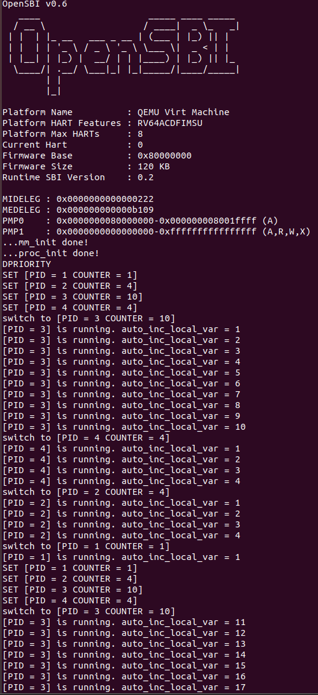
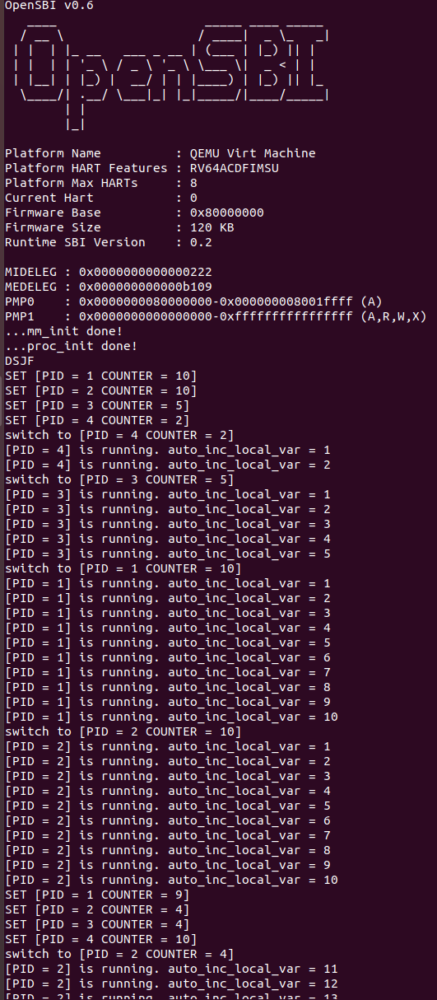
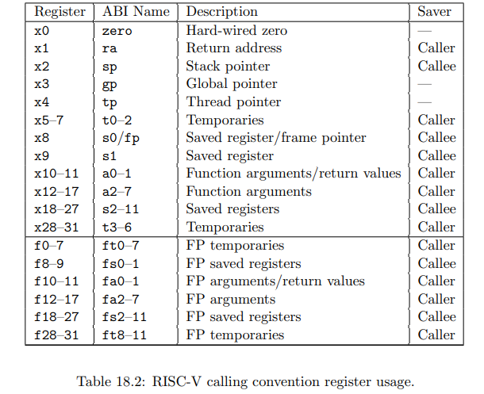
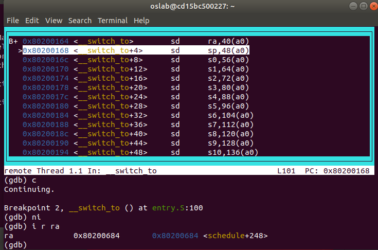
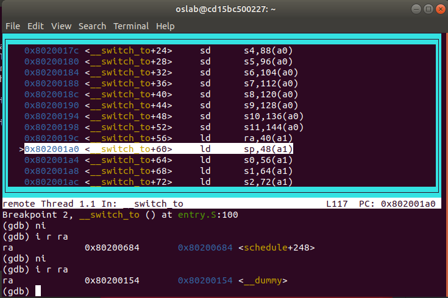

<h4 align = "center">课程名称：                     操作系统</h4>

<h4 align = "center">姓名：                     何瑞桓 周琪东</h4>

<h4 align = "center">学院：  竺可桢学院</h4>

<h4 align = "center">专业：                     计算机科学与技术</h4>

<h4 align = "center">学号：  3190101928 3190106231</h4>

<h4 align = "center">指导老师：                    季江民</h4>


<h3 align = "center">2021年11月16日</h3>

<div style="page-break-after:always"></div>

<h1 align = "center">浙江大学实验报告</h1>

<h1 align = "center">RV64 内核线程调度</h1>

# 一、实验内容

## 1. 准备工程

* 此次实验基于 lab2 同学所实现的代码进行。

* 从 `repo` 同步以下代码: `rand.h/rand.c`, `string.h/string.c`, `mm.h/mm.c`。并按照以下步骤将这些文件正确放置。其中 `mm.h\mm.c` 提供了简单的物理内存管理接口，`rand.h\rand.c`提供了 `rand()` 接口用以提供伪随机数序列，`string.h/string.c`提供了`memset` 接口用以初始化一段内存空间。

  ```
  .
  ├── arch
  │   └── riscv
  │       ├── include
  │       │   └── mm.h
  │       └── kernel
  │           └── mm.c
  ├── include
  │   ├── rand.h
  │   └── string.h
  └── lib
      ├── rand.c
      └── string.c
  ```

* 在 lab3 中我们需要一些物理内存管理的接口，在此我们提供了 `kalloc` 接口 ( 见`mm.c` ) 给同学。同学可以用 `kalloc` 来申请 4KB 的物理页。由于引入了简单的物理内存管理，需要在 `_start` 的适当位置调用`mm_init`, 来初始化内存管理系统，并且在初始化时需要用一些自定义的宏，需要修改 `defs.h`, 在 `defs.h` `添加` 如下内容：

  ```c++
  #define PHY_START 0x0000000080000000
  #define PHY_SIZE  128 * 1024 * 1024 // 128MB， QEMU 默认内存大小
  #define PHY_END   (PHY_START + PHY_SIZE)
  
  #define PGSIZE 0x1000 // 4KB
  #define PGROUNDUP(addr) ((addr + PGSIZE - 1) & (~(PGSIZE - 1)))
  #define PGROUNDDOWN(addr) (addr & (~(PGSIZE - 1)))
  ```

- 在`arch/riscv/include`下添加`proc.h`

  ```c
  // arch/riscv/include/proc.h
  
  #include "types.h"
  
  #define NR_TASKS  (1 + 31) // 用于控制 最大线程数量 （idle 线程 + 31 内核线程）
  
  #define TASK_RUNNING    0 // 为了简化实验，所有的线程都只有一种状态
  
  #define PRIORITY_MIN 1
  #define PRIORITY_MAX 10
  
  /* 用于记录 `线程` 的 `内核栈与用户栈指针` */
  /* (lab3中无需考虑，在这里引入是为了之后实验的使用) */
  struct thread_info {
      uint64 kernel_sp;
      uint64 user_sp;
  };
  
  /* 线程状态段数据结构 */
  struct thread_struct {
      uint64 ra;
      uint64 sp;
      uint64 s[12];
  };
  
  /* 线程数据结构 */
  struct task_struct {
      struct thread_info* thread_info;
      uint64 state;    // 线程状态
      uint64 counter;  // 运行剩余时间
      uint64 priority; // 运行优先级 1最低 10最高
      uint64 pid;      // 线程id
  
      struct thread_struct thread;
  };
  
  /* 线程初始化 创建 NR_TASKS 个线程 */
  void task_init();
  
  /* 在时钟中断处理中被调用 用于判断是否需要进行调度 */
  void do_timer();
  
  /* 调度程序 选择出下一个运行的线程 */
  void schedule();
  
  /* 线程切换入口函数*/
  void switch_to(struct task_struct* next);
  
  /* dummy funciton: 一个循环程序，循环输出自己的 pid 以及一个自增的局部变量*/
  void dummy();
  
  ```

## 2. 线程调度功能

### 2.1 线程初始化

* 在初始化线程的时候，我们参考[Linux v0.11中的实现](https://elixir.bootlin.com/linux/0.11/source/kernel/fork.c#L93)为每个线程分配一个 4KB 的物理页，我们将 `task_struct` 存放在该页的低地址部分， 将线程的栈指针 `sp` 指向该页的高地址。具体内存布局如下图所示：

  ```
                      ┌─────────────┐◄─── High Address
                      │             │
                      │    stack    │
                      │             │
                      │             │
                sp ──►├──────┬──────┤
                      │      │      │
                      │      ▼      │
                      │             │
                      │             │
                      │             │
                      │             │
      4KB Page        │             │
                      │             │
                      │             │
                      │             │
                      ├─────────────┤
                      │             │
                      │             │
                      │ task_struct │
                      │             │
                      │             │
                      └─────────────┘◄─── Low Address
  ```

* 当我们的 OS run 起来时候，其本身就是一个线程 `idle 线程`，但是我们并没有为它设计好 `task_struct`。所以第一步我们要为 `idle` 设置 `task_struct`。并将 `current`, `task[0]` 都指向 `idle`。

* 为了方便起见，我们将 `task[1]` ~ `task[NR_TASKS - 1]`, 全部初始化， 这里和 `idle` 设置的区别在于要为这些线程设置 `thread_struct` 中的 `ra` 和 `sp`.

* 在 `_start` 适当的位置调用 `task_init`和`mm_init`

```c
void task_init() {
    // 1. 调⽤ kalloc() 为 idle 分配⼀个物理⻚
    idle = (struct task_struct *) kalloc();
    // 2. 设置 state 为 TASK_RUNNING;
    idle->state = TASK_RUNNING;
    // 3. 由于 idle 不参与调度 可以将其 counter / priority 设置为 0
    idle->counter = 0;
    idle->priority = 0;
    // 4. 设置 idle 的 pid 为 0
    idle->pid = 0;
    // 5. 将 current 和 task[0] 指向 idle
    current = idle;
    task[0] = idle;
    /* YOUR CODE HERE */
    // 1. 参考 idle 的设置, 为 task[1] ~ task[NR_TASKS - 1] 进⾏初始化
    // 2. 其中每个线程的 state 为 TASK_RUNNING, counter 为 0, priority 使⽤ rand() 来设置,pid 为该线程在线程数组中的下标。
    // 3. 为 task[1] ~ task[NR_TASKS - 1] 设置 `thread_struct` 中的 `ra` 和 `sp`,
    // 4. 其中 `ra` 设置为 __dummy （⻅ 4.3.2）的地址， `sp` 设置为 该线程申请的物理⻚的⾼地址
    /* YOUR CODE HERE */
    for (int i = 1; i < NR_TASKS; ++i) {
        task[i] = (struct task_struct *) kalloc();
        task[i]->state = TASK_RUNNING;
        task[i]->counter = 0;
        task[i]->pid = i;
        task[i]->priority = rand();
        task[i]->thread.ra = (uint64) &__dummy;
        task[i]->thread.sp = PGROUNDUP((uint64) task[i]);
    }
    printk("...proc_init done!\n");
}
```

```asm
# head.S
.extern start_kernel
    .section .text.init
    .globl _start
_start:
    # ------------------
    # - your code here -
    # set stvec = _traps
    la sp, boot_stack
    la t0, _traps
    csrrw x0, stvec, t0
    # ------------------
    # set sie[STIE] = 1
    li t0, 0x00000020
    csrrs x0, sie, t0
    # ------------------
    # set first time interrupt
    call mm_init
    call task_init
    call clock_set_next_event
    # ------------------
    # set sstatus[SIE] = 1
    li t1, 0x00000002
    csrrs x0, sstatus, t1
    # ------------------
    # ------------------
    # - your lab1 code -
    # ------------------

    call start_kernel
    # ------------------

    .section .bss.stack
    .globl boot_stack
boot_stack:
    .space 4096 # <-- change to your stack size

    .globl boot_stack_top
boot_stack_top:
```

​	注意：要将lab1完成的`la sp, boot_stack`放在两个init前

### 2.2 `__dummy` 与 `dummy` 完成

* `task[1]` ~ `task[NR_TASKS - 1]`都运行同一段代码 `dummy()` 我们在 `proc.c` 添加 `dummy()`:

  ```c++
  // arch/riscv/kernel/proc.c
  int flag=0;
  void dummy() {
      uint64 MOD = 1000000007;
      uint64 auto_inc_local_var = 0;
      int last_counter = -1;
      while (1) {
          if (last_counter == -1 || current->counter != last_counter || flag) {
              last_counter = current->counter;
              auto_inc_local_var = (auto_inc_local_var + 1) % MOD;
              printk("[PID = %d] is running. auto_inc_local_var = %d\n", current->pid,
                     auto_inc_local_var);
              flag = 0;
          }
      }
  }
  ```

​		注：加入全局变量flag用于标志是否刚刚发生跳转。

* 当线程在运行时，由于时钟中断的触发，会将当前运行线程的上下文环境保存在栈上 ( lab2 中实现的 `_traps` )。 当线程再次被调度时，会将上下文从栈上恢复，但是当我们创建一个新的线程，此时线程的栈为空，当这个线程被调度时，是没有上下文需要被恢复的，所以我们需要为线程`第一次调度`提供一个特殊的返回函数 `__dummy`

* 在 `entry.S` 添加 `__dummy`

  - 在`__dummy` 中将 sepc 设置为 `dummy()` 的地址, 并使用 `sret` 从中断中返回。
  - `__dummy` 与 `_traps`的 `restore`部分相比， 其实就是省略了从栈上恢复上下文的过程 （ 但是手动设置了 `sepc` ）。

  ```asm
  .globl __dummy
  __dummy:
      la t0, dummy
      csrw sepc, t0
      sret
  ```

### 2.3 实现线程切换

* 判断下一个执行的线程 `next` 与当前的线程 `current` 是否为同一个线程，如果是同一个线程，则无需做任何处理，否则调用 `__switch_to` 进行线程切换。

  ```c++
  // arch/riscv/kernel/proc.c
  
  extern void __switch_to(struct task_struct* prev, struct task_struct* next);
  
  void switch_to(struct task_struct *next) {
      /* YOUR CODE HERE */
      if (current->pid != next->pid) {
          struct task_struct* temp;
          temp = current;
          current = next;
          __switch_to(temp, next);
          flag = 1;
      }
  }
  ```

* 在 `entry.S` 中实现线程上下文切换 `__switch_to`:

  - `__switch_to`接受两个 `task_struct` 指针作为参数
  - 保存当前线程的`ra`, `sp`, `s0~s11`到当前线程的 `thread_struct` 中
  - 将下一个线程的 `thread_struct` 中的相关数据载入到`ra`, `sp`, `s0~s11`中。

  ```asm
  # arch/riscv/kernel/entry.S
  
   	.globl __switch_to
  __switch_to:
      # save state to prev process
      # YOUR CODE HERE
      sd ra, 40(a0)
      sd sp, 48(a0)
      sd s0, 56(a0)
      sd s1, 64(a0)
      sd s2, 72(a0)
      sd s3, 80(a0)
      sd s4, 88(a0)
      sd s5, 96(a0)
      sd s6, 104(a0)
      sd s7, 112(a0)
      sd s8, 120(a0)
      sd s9, 128(a0)
      sd s10, 136(a0)
      sd s11, 144(a0)
      # restore state from next process
      # YOUR CODE HERE
      ld ra, 40(a1)
      ld sp, 48(a1)
      ld s0, 56(a1)
      ld s1, 64(a1)
      ld s2, 72(a1)
      ld s3, 80(a1)
      ld s4, 88(a1)
      ld s5, 96(a1)
      ld s6, 104(a1)
      ld s7, 112(a1)
      ld s8, 120(a1)
      ld s9, 128(a1)
      ld s10, 136(a1)
      ld s11, 144(a1)
      ret
  ```

### 2.4 实现调度入口函数

- 实现 `do_timer()`, 并在 `时钟中断处理函数` 中调用。

```c++
// arch/riscv/kernel/proc.c

void do_timer(void) {
    /* 1. 如果当前线程是 idle 线程 直接进⾏调度 */
    /* 2. 如果当前线程不是 idle 对当前线程的运⾏剩余时间减 1
    若剩余时间任然⼤于0 则直接返回 否则进⾏调度 */
    /* YOUR CODE HERE */
    if (idle->pid == current->pid) {
        schedule();
    } else {
        current->counter--;
        if (current->counter <= 0) {
            schedule();
        }
    }
}
```

```c
void trap_handler(unsigned long scause, unsigned long sepc) {
    long scause_1 = (long)scause;
    if(scause_1 < 0) {
        if (scause == 0x8000000000000005) {
//            printk("kernel is running!\n");
//            printk("[S] Supervisor Mode Timer Interrupt\n");
            clock_set_next_event();
            do_timer();
        }
    }

}
```

do_timer最好放在clock_set_next_event后。

### 2.5 实现线程调度 

本次实验我们需要实现两种调度算法：1.短作业优先调度算法，2.优先级调度算法。

#### 2.5.1 短作业优先调度算法

* 当需要进行调度时按照一下规则进行调度：

  * 遍历线程指针数组`task`(不包括 `idle` ，即 `task[0]` )，在所有运行状态 (`TASK_RUNNING`) 下的线程运行剩余时间`最少`的线程作为下一个执行的线程。
  * 如果`所有`运行状态下的线程运行剩余时间都为0，则对 `task[1]` ~ `task[NR_TASKS-1]` 的运行剩余时间重新赋值 (使用 `rand()`) ，之后再重新进行调度。

  ```c++
  // arch/riscv/kernel/proc.c
  
  void schedule(void) {
      int shortest = 0;
      for (int i = 1; i < NR_TASKS; ++i) {
          if (task[i]->state == TASK_RUNNING)
              if ((task[i]->counter < task[shortest]->counter && task[i]->counter > 0) || task[shortest]->counter <= 0) {
                  shortest = i;
              }
      }
      if (task[shortest]->counter <= 0) {
          for (int i = 1; i < NR_TASKS; ++i) {
              task[i]->counter = rand();
              printk("SET [PID = %d COUNTER = %d]\n", i, task[i]->counter);
          }
          shortest = 0;
          for (int i = 1; i < NR_TASKS; ++i) {
              if (task[i]->state == TASK_RUNNING)
                  if ((task[i]->counter < task[shortest]->counter && 
                       task[i]->counter > 0) ||
                      task[shortest]->counter <= 0) {
                      shortest = i;
                  }
          }
      }
      printk("switch to [PID = %d COUNTER = %d]\n", shortest, task[shortest]->counter);
      switch_to(task[shortest]);
  }
  ```

#### 2.5.2 优先级调度算法

* 参考 [Linux v0.11 调度算法实现](https://elixir.bootlin.com/linux/0.11/source/kernel/sched.c#L122) 实现。

  ```c++
  // arch/riscv/kernel/proc.c
  
  void schedule(void) {
      int i, next, c;
      while (1) {
          c = -1;
          next = 0;
          i = NR_TASKS;
          while (--i) {
              if (task[i]->state!=TASK_RUNNING)
                  continue;
              if ((int)(task[i]->counter) > c) {
                  c = task[i]->counter;
                  next = i;
              }
          }
          if (c>0) break;
          for(i = 1; i<NR_TASKS  ; ++i) {
              if (task[i]->state == TASK_RUNNING) {
                  (task[i])->counter = ((task[i])->counter >> 1) +
                                       (task[i])->priority;
                  printk("SET [PID = %d COUNTER = %d]\n", i, task[i]->counter);
              }
          }
      }
      printk("switch to [PID = %d COUNTER = %d]\n", next, task[next]->counter);
      switch_to(task[next]);
  }
  ```

		#### 2.5.3 调度算法切换

在`Makefile`中加入如下

```makefile
CFLAG = ${CF} ${INCLUDE}  -D DSJF -g
```

在两个调度算法前使用

```c++
#ifdef DSJF

//DSJF算法实现

#else

//DPRIORITY算法实现

#endif
```

默认调用`DSJF`，去掉`Makefile`中的`-D DSJF`就可以调用`DPRIORITY`算法

在`main.c`里添加

```c
#ifdef DSJF
    printk("DSJF\n");
#else
    printk("DPRIORITY\n");
#endif
```

用于标注当前执行的调度算法。

## 3. 编译及测试

为了较好的体现实验效果，将线程数量降为`1+4`

`DSJF`:



`DPRIORITY`:



得到了想要实现的效果，将线程数改为1+31依然得到了理想的结果。

# 二、思考题

1. 在 RV64 中一共用 32 个通用寄存器， 为什么 `context_switch` 中只保存了14个 ？

   答：`context_switch`中需要保存`Callee-saved register`，即非易失性寄存器，这13个寄存器在调用的过程中需要由被调用者来保护，所以`context-swicth`需要对他们进行保存,除此之外还需要更改ra的值来实现跳转，所以一共需要保存14个寄存器，其余寄存器为`caller-saved register`如果需要保护寄存器的值，需要由调用函数者将其存入栈中。

   

2. 当线程第一次调用时， 其 `ra` 所代表的返回点是 `__dummy`。 那么在之后的线程调用中 `context_switch` 中，`ra` 保存/恢复的函数返回点是什么呢 ？ 请同学用gdb尝试追踪一次完整的线程切换流程， 并关注每一次 `ra` 的变换。

   答：`context_switch`中每次被存入的`ra`值是`schedule`的末尾处的地址，即`schedule`调用`context_switch`处的地址,而被恢复的都是指向`__dummy`的地址。

   



# 三、心得体会

## 1. `mm_init`放置位置

`mm_init`会使用sp寄存器，所以应该在`mm_init`前为sp寄存器赋初值，否则会导致越界。

`mm_init`, `task_init`最好放于`clock_set_next_event`前，虽然本次实验设置的时间是一秒比较长，但如果设置的时间比较短可能在完成init前发生时钟中断，所以应该在完成init后再设置时钟中断，而这样的设置和lab2的参考代码是不符合的，花了我比较长的时间来发现这一错误。

## 2. `switch_to`代码位置

```c
void switch_to(struct task_struct *next) {
    /* YOUR CODE HERE */
    if (current->pid != next->pid) {
        struct task_struct* temp;
        temp = current;
        current = next;
        flag = 1;
        __switch_to(temp, next);
        
    }
}
```

__swich_to函数并不会帮你设置后current和next的关系，所以需要你手动去设置，但`current = next;`这一句不能放在`__switch_to(temp, next);`后，因为在`__switch_to(temp, next);`处发生的跳转并不会回到这里而是会直接进入`dummy`函数。

## 3. `dummy`运行判断

实验给定的`dummy`是存在问题的，一般情况下不太常见，将`rand`修改为输出1~2之间的整数就会发现，对`counter=1`的线程，即使发生了跳转也会因为last_counter和counter相等而不会执行输出，所以添加了全局变量flag，在发生跳转时对flag赋真值，在flag为真时一定进行输出，解决了这一问题。


## 总结

感觉本次实验还是比较困难的，实验指导可能因为是新开设的实验，感觉蛮多地方其实并不完善，如果不从大体去思考和理解这个项目，只是盲目地按照给的指导去做就会出现很多问题。但做出来以后还是很有成就感的。

