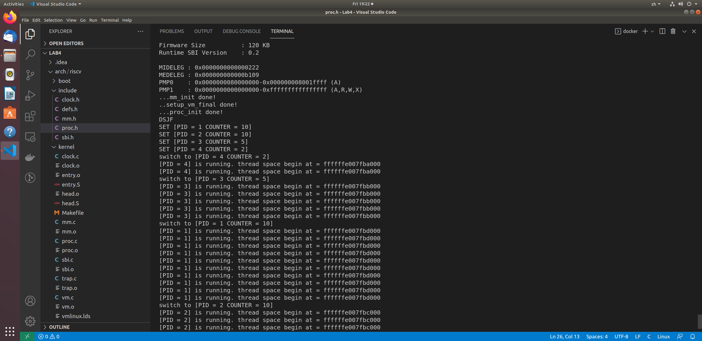
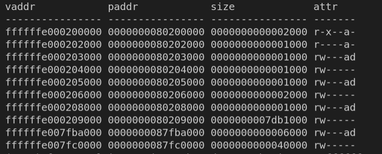

<h4 align = "center">课程名称：                     操作系统</h4>

<h4 align = "center">XXX</h4>

<h4 align = "center">学院：  竺可桢学院</h4>

<h4 align = "center">专业：                     计算机科学与技术</h4>

<h4 align = "center">学号：  XXX</h4>

<h4 align = "center">指导老师：                    XXX</h4>

<h3 align = "center">2021年12月23日</h3>

<div style="page-break-after:always"></div>

<h1 align = "center">浙江大学实验报告</h1>

<h1 align = "center">RV64 虚拟内存管理</h1>

## 一、实验内容

### 1. 准备工程

* 此次实验基于 lab3 同学所实现的代码进行。

* 需要修改 `defs.h`, 在 `defs.h` `添加` 如下内容：

  ```c
  #define OPENSBI_SIZE (0x200000)
  
  #define VM_START (0xffffffe000000000)
  #define VM_END   (0xffffffff00000000)
  #define VM_SIZE  (VM_END - VM_START)
  
  #define PA2VA_OFFSET (VM_START - PHY_START)
  ```

* 从 `repo` 同步以下代码: `vmlinux.lds.S`, `Makefile`。并按照以下步骤将这些文件正确放置。

  ```
  .
  └── arch
      └── riscv
          └── kernel
              ├── Makefile
              └── vmlinux.lds.S
  ```

  这里我们通过 `vmlinux.lds.S` 模版生成 `vmlinux.lds`文件。链接脚本中的 `ramv` 代表 `LMA ( Virtual Memory Address )`即虚拟地址， `ram` 则代表 `LMA ( Load Memory Address )`, 即我们 OS image 被 load 的地址，可以理解为物理地址。使用以上的 vmlinux.lds 进行编译之后，得到的 `System.map` 以及 `vmlinux` 采用的都是虚拟地址，方便之后 Debug。

### 2. 开启虚拟内存映射

#### 2.1 `swtup_vm`的实现

* 将 0x80000000 开始的 1GB 区域进行两次映射，其中一次是等值映射 ( PA == VA ) ，另一次是将其映射至高地址 ( PA + PV2VA_OFFSET == VA )。如下图所示：

  ```text
  Physical Address
  -------------------------------------------
                       | OpenSBI | Kernel |
  -------------------------------------------
                       ^
                  0x80000000
                       ├───────────────────────────────────────────────────┐
                       |                                                   |
  Virtual Address      ↓                                                   ↓
  -----------------------------------------------------------------------------------------------
                       | OpenSBI | Kernel |                                | OpenSBI | Kernel |
  -----------------------------------------------------------------------------------------------
                       ^                                                   ^
                  0x80000000                                       0xffffffe000000000
  ```

* 完成上述映射之后，通过 `relocate`函数，完成对 `satp`的设置，以及跳转到对应的虚拟地址。

* 至此我们已经完成了虚拟地址的开启，之后我们运行的代码也都将在虚拟地址上运行。

```c
// arch/riscv/kernel/vm.c

/* early_pgtbl: 用于 setup_vm 进行 1GB 的 映射。 */
unsigned long  early_pgtbl[512] __attribute__((__aligned__(0x1000)));

void setup_vm(void) {
    /* 
    1. 由于是进行 1GB 的映射 这里不需要使用多级页表 
    2. 将 va 的 64bit 作为如下划分： | high bit | 9 bit | 30 bit |
        high bit 可以忽略
        中间9 bit 作为 early_pgtbl 的 index
        低 30 bit 作为 页内偏移 这里注意到 30 = 9 + 9 + 12， 即我们只使用根页表， 根页表的每个 entry 都对应 1GB 的区域。 
    3. Page Table Entry 的权限 V | R | W | X 位设置为 1
    */
    early_pgtbl[2] = 0x000000002000000F;
    early_pgtbl[384] = 0x000000002000000F;
}
```

```assembly
_start:

    la sp, boot_stack
    # set the vm first to make mm_init work in va
    # 最开始设置虚拟内存以保证mm_init在虚拟地址下正常工作
    call setup_vm
    call relocate
    # ------------------
    # - your code here -
    # set stvec = _traps
    
    la t0, _traps
    csrrw x0, stvec, t0
    # ------------------
    # set sie[STIE] = 1
    li t0, 0x00000020
    csrrs x0, sie, t0
    # ------------------
    # set first time interrupt
    call mm_init
    #在设置mm_init后设置需要调用kalloc()的setup_vm_final
    call setup_vm_final
    
    call task_init
    call clock_set_next_event
    # ------------------
    # set sstatus[SIE] = 1
    li t1, 0x00000002
    csrrs x0, sstatus, t1
    # ------------------
    # ------------------
    # - your lab1 code -
    # ------------------

    call start_kernel
    # ------------------
relocate:
    # set ra = ra + PA2VA_OFFSET
    # set sp = sp + PA2VA_OFFSET (If you have set the sp before)
   
    ###################### 
    #   YOUR CODE HERE   #
    li t0, 0xffffffdf80000000
    add ra, ra, t0
    add sp, sp, t0
    ######################

    # set satp with early_pgtbl
    
    ###################### 
    #   YOUR CODE HERE   #
    la  t0, early_pgtbl
    srl t0, t0, 12
    li  t1, 0x8000000000000000
    add t0, t0, t1
    csrrw x0, satp, t0
    ######################
    
    # flush tlb
    sfence.vma zero, zero

    ret
```

#### 2.2 `setup_vm_final`的实现

* 由于 setup_vm_final 中需要申请页面的接口， 应该在其之前完成内存管理初始化， 需要修改 mm.c 中的代码，mm.c 中初始化的函数接收的起始结束地址需要调整为虚拟地址。

  ```c
  // arch/riscv/kernel/mm.c
  
  void mm_init(void) {
      printk("...mm_init ");
      kfreerange(_ekernel, (char *)(PHY_END + PA2VA_OFFSET));
      printk("done!\n");
  }
  ```

* 对 所有物理内存 (128M) 进行映射，并设置正确的权限。

```text
Physical Address
     PHY_START                           PHY_END
         ↓                                  ↓
--------------------------------------------------------
         | OpenSBI | Kernel |               |
--------------------------------------------------------
         ^                                  ^
    0x80000000                              └───────────────────────────────────────────────────┐
         └───────────────────────────────────────────────────┐                                  |
                                                             |                                  |
                                                          VM_START                              |
Virtual Address                                              ↓                                  ↓
----------------------------------------------------------------------------------------------------
                                                             | OpenSBI | Kernel |               |
-----------------------------------------------------------------------------------------------------
                                                             ^
                                                     0xffffffe000000000
```


* 不再需要进行等值映射
* 不再需要将 OpenSBI 的映射至高地址，因为 OpenSBI 运行在 M 态， 直接使用的物理地址。
* 采用三级页表映射。
* 在 head.S 中 适当的位置调用 setup_vm_final 。

```c
// arch/riscv/kernel/vm.c 

void setup_vm_final(void) {
    printk("..setup_vm_final "); 
    memset(swapper_pg_dir, 0x0, PGSIZE);

    // No OpenSBI mapping required
    // printk("final\n");
    // mapping kernel text X|-|R|V

    create_mapping(swapper_pg_dir, _stext, _stext-PA2VA_OFFSET, (unsigned long)_srodata-(unsigned long)_stext, 11);
    
    // mapping kernel rodata -|-|R|V
    create_mapping(swapper_pg_dir, _srodata, _srodata-PA2VA_OFFSET, (unsigned long)_sdata-(unsigned long)_srodata, 3);
    
    // mapping other memory -|W|R|V
    create_mapping(swapper_pg_dir, _sdata, _sdata-PA2VA_OFFSET, PHY_SIZE-PGROUNDUP(0x203000), 7);
    
    // set satp with swapper_pg_dir
    
    //YOUR CODE HERE
    unsigned long swp = (unsigned long)swapper_pg_dir-PA2VA_OFFSET;
    asm volatile (
        "mv t0, %[addr]\n"
        "li t1, 0x8000000000000000\n"
        "srl t0, t0, 12\n"
        "add t0, t0, t1\n"
        "csrrw x0, satp, t0\n"
        :   
        :[addr] "r" (swp)
        :"memory"
    );
    // flush TLB
    // printk("done");
    asm volatile ("sfence.vma zero, zero");
    printk("done!\n");
    return;
}


/* 创建多级页表映射关系 */
create_mapping(unsigned long *pgtbl, unsigned long va, unsigned long pa, unsigned long sz, int perm) {
    /*
    pgtbl 为根页表的基地址
    va, pa 为需要映射的虚拟地址、物理地址
    sz 为映射的大小
    perm 为映射的读写权限
    创建多级页表的时候可以使用 kalloc() 来获取一页作为页表目录
    可以使用 V bit 来判断页表项是否存在
    */
//    printk("start mapping\n");
    unsigned long *pg2nd, *pg3rd;
    unsigned long tb1, tb2, tb3;
    unsigned long size = sz;
    // 循环直到所有待分配的内存都被分配
    while (size <0x8000000000000000 && size!=0)
   {
       /* code */
    //    printk("size = %x\n", size);
        tb1 = (va >> 30) & 0x1ff;
        tb2 = (va >> 21) & 0x1ff;
        tb3 = (va >> 12) & 0x1ff;
        if (!(pgtbl[tb1]&0x1)) {
                pg2nd = (unsigned long*)(kalloc());
                memset(pg2nd, 0x0, PGSIZE);
            	//因为页表内存储的是物理地址所以需要对kalloc的结果减去偏移量
                pgtbl[tb1] = ((((unsigned long)pg2nd-PA2VA_OFFSET)&(~0xfffl))>>2)|0x1;
          
        } else {
            pg2nd = ((pgtbl[tb1]&(0xFFFFFFFFFFFFFC00))<<2)+PA2VA_OFFSET;
        }
        
        if (!(pg2nd[tb2]&0x1)) {
                pg3rd = (unsigned long*)(kalloc());
                memset(pg3rd, 0x0, PGSIZE);
                pg2nd[tb2] = ((((unsigned long)pg3rd-PA2VA_OFFSET)&(~0xfffl))>>2)|0x1;
                pg3rd[tb3] = ((pa&(~0xfffl))>>2)|perm;
        } else {
            pg3rd = ((pg2nd[tb2]&(0xFFFFFFFFFFFFFC00))<<2)+PA2VA_OFFSET;
            pg3rd[tb3] = ((pa&(~0xfffl))>>2)|perm;
        }
        va += PGSIZE;
        pa += PGSIZE;
        size -= PGSIZE;
        //更新各参数
   }  
   
}
```

### 3. 编译及测试

为了方便显示每个线程的地址，修改proc.c如下

```c
// /arch/riscv/kernel/proc.c

void dummy() {
    unsigned long MOD = 1000000007;
    unsigned long auto_inc_local_var = 0;
    int last_counter = -1;
    while (1) {
        if (last_counter == -1 || current->counter != last_counter || flag) {
            last_counter = current->counter;
            auto_inc_local_var = (auto_inc_local_var + 1) % MOD;
            printk("[PID = %d] is running. thread space begin at = %lx\n", current->pid,
                   current);
            flag = 0;
        }
    }
}
```

输出结果如下，未方便显示只创建了四个线程



可以看到程序正常运行且输出了预想中的结果

## 二、思考题

1. 验证 `.text`, `.rodata` 段的属性是否成功设置，给出截图。

   在QEMU运行时键入`ctrl+a`后按`c`，再输入`info mem`就可以查看映射的虚拟地址

   

   对照`system.map`可以知道我们得到了正确的答案

   ```
   // ./system.map
   ......
   ffffffe000204000 B _sbss
   ffffffe000203000 D _sdata
   ffffffe000200000 T _skernel
   ffffffe000202000 R _srodata
   ffffffe000200000 T _start
   ffffffe000200000 T _stext
   ffffffe000200074 T _traps
   ......
   ```

2. 为什么我们在 `setup_vm` 中需要做等值映射?

   ​        在`relocate`函数中刷新`tlb`后，会执行`ret`指令，而此时`ret`的目标地址为物理地址，如果不进行等值映射，`ret`指令将无法正确执行。

3. 在 `Linux` 中，是不需要做等值映射的。请探索一下不在 `setup_vm` 中做等值映射的方法。

   ​        查看`Linux`源码可以发现，在其中的`relocate`函数，对`stvec`的值进行了修改

   ```assembly
   	la a0, 1f
   	add a0, a0, a1
   	csrw stvec, a0
   ```

   ​        将`stvec`的值修改为`relocate`后的第一条指令，在修改tbl后，因为寻址发生错误，下一条指令会跳转到`stvec`指向的指令，程序就可以顺利运行，再将`stvec`改回中断处理即可，这样就可以在不进行等值映射的情况下正确的跳转。

## 三、心得体会

​		感觉本次实验还是比较困难的，虽然内容不多，最开始写完代码只花了两个小时不到，但debug和调试的时间花了很多，感觉可以在实验指导上给更多的调试提示和指导，很多时候是和其他同学互相交流一些调试的技巧才找到方法去对程序进行修改。但总的来说感觉还是学到了很多东西，对于虚拟内存的了解也更深厚了。

