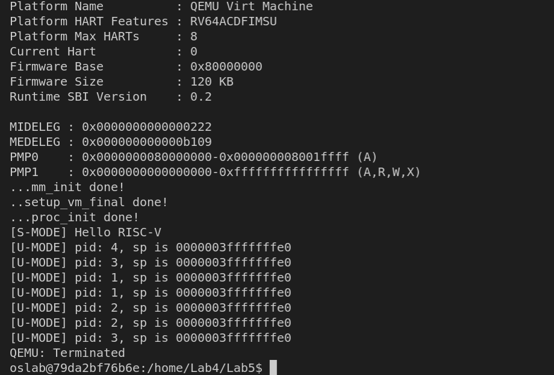

<h4 align = "center">课程名称：                     操作系统</h4>

<h4 align = "center">姓名：                     XXX</h4>

<h4 align = "center">学院：  竺可桢学院</h4>

<h4 align = "center">专业：                     计算机科学与技术</h4>

<h4 align = "center">学号：  XXX</h4>

<h4 align = "center">指导老师：                    XXX</h4>


<h3 align = "center">2021年12月30日</h3>

<div style="page-break-after:always"></div>

<h1 align = "center">浙江大学实验报告</h1>

<h1 align = "center">RV64 虚拟内存管理</h1>

## 一、实验内容

### 1. 准备工程

* 此次实验基于 lab4 同学所实现的代码进行。
* 需要修改 `vmlinux.lds.S`，将用户态程序 `uapp` 加载至 `.data` 段。按如下修改：

```
...

.data : ALIGN(0x1000){
        _sdata = .;

        *(.sdata .sdata*)
        *(.data .data.*)

        _edata = .;
        
        . = ALIGN(0x1000);
        uapp_start = .;
        *(.uapp .uapp*)
        uapp_end = .;
        . = ALIGN(0x1000);

    } >ramv AT>ram

...
```

* 需要修改 `defs.h`，在 `defs.h` `添加` 如下内容：

```c
#define USER_START (0x0000000000000000) // user space start virtual address
#define USER_END   (0x0000004000000000) // user space end virtual address
```

* 从 `repo` 同步以下文件夹: `user`， `Makefile`。并按照以下步骤将这些文件正确放置。

```
.
├── arch
│   └── riscv
│       └── Makefile
└── user
    ├── Makefile
    ├── getpid.c
    ├── link.lds
    ├── printf.c
    ├── start.S
    ├── stddef.h
    ├── stdio.h
    ├── syscall.h
    └── uapp.S
```

* 修改**根目录**下的 Makefile, 将 `user` 纳入工程管理。

  ```makefile
  # ./Makefile
  # ...
  all:
  	${MAKE} -C lib all
  	${MAKE} -C init all
  	${MAKE} -C user all
  	${MAKE} -C arch/riscv all
  	@echo -e '\n'Build Finished OK
  # ...
  ```

### 2. 创建用户态进程

* 本次实验只需要创建 4 个用户态进程，修改 `proc.h` 中的 `NR_TASKS` 即可。
* 由于创建用户态进程要对 `sepc` `sstatus` `sscratch` 做设置，我们将其加入 `thread_struct` 中。
* 由于多个用户态进程需要保证相对隔离，因此不可以共用页表。我们为每个用户态进程都创建一个页表。修改 `task_struct` 如下

```c
// proc.h 

typedef unsigned long* pagetable_t;

struct thread_struct {
    uint64_t ra;
    uint64_t sp;                     
    uint64_t s[12];

    uint64_t sepc, sstatus, sscratch; 
};

struct task_struct {
    struct thread_info* thread_info;
    uint64_t state;
    uint64_t counter;
    uint64_t priority;
    uint64_t pid;

    struct thread_struct thread;

    pagetable_t pgd;
};
```

* 修改 task_init

  * 对每个用户态进程，其拥有两个 stack： `U-Mode Stack` 以及 `S-Mode Stack`， 其中 `S-Mode Stack` 在 `lab3` 中我们已经设置好了。我们可以通过 `kalloc` 接口申请一个空的页面来作为 `U-Mode Stack`。

  * 为每个用户态进程创建自己的页表 并将 `uapp` 所在页面，以及 `U-Mode Stack` 做相应的映射，同时为了避免 `U-Mode` 和 `S-Mode` 切换的时候切换页表，我们也将内核页表 （ `swapper_pg_dir` ） 复制到每个进程的页表中。

  * 对每个用户态进程我们需要将 `sepc` 修改为 `USER_START`， 设置 `sstatus` 中的 `SPP` （ 使得 sret 返回至 U-Mode ）， `SPIE` （ sret 之后开启中断 ）， `SUM` （ S-Mode 可以访问 User 页面 ）， `sscratch` 设置为 `U-Mode` 的 sp，其值为 `USER_END` （即  `U-Mode Stack` 被放置在 `user space` 的最后一个页面）。

    > The SPP bit indicates the privilege level at which a hart was executing before entering supervisor mode. When a trap is taken, SPP is set to 0 if the trap originated from user mode, or 1 otherwise. When an SRET instruction (see Section 3.2.2) is executed to return from the trap handler, the privilege level is set to user mode if the SPP bit is 0, or supervisor mode if the SPP bit is 1; SPP is then set to 0.
    >
    > The SIE bit enables or disables all interrupts in supervisor mode. When SIE is clear, interrupts are not taken while in supervisor mode. When the hart is running in user-mode, the value in SIE is ignored, and supervisor-level interrupts are enabled. The supervisor can disable individual interrupt sources using the sie CSR.
    >
    > The SPIE bit indicates whether supervisor interrupts were enabled prior to trapping into supervisor mode. When a trap is taken into supervisor mode, SPIE is set to SIE, and SIE is set to 0. When an SRET instruction is executed, SIE is set to SPIE, then SPIE is set to 1.
    >
    > The SUM (permit Supervisor User Memory access) bit modifies the privilege with which S-mode loads and stores access virtual memory. When SUM=0, S-mode memory accesses to pages that are accessible by U-mode (U=1 in Figure 4.17) will fault. When SUM=1, these accesses are permitted. SUM has no effect when page-based virtual memory is not in effect, nor when executing in U-mode. Note that S-mode can never execute instructions from user pages, regardless of the state of SUM.

```c
void task_init() {
    // 1. 调⽤ kalloc() 为 idle 分配⼀个物理⻚
    idle = (struct task_struct *) kalloc();
    // 2. 设置 state 为 TASK_RUNNING;
    idle->state = TASK_RUNNING;
    // 3. 由于 idle 不参与调度 可以将其 counter / priority 设置为 0
    idle->counter = 0;
    idle->priority = 0;
    // 4. 设置 idle 的 pid 为 0
    idle->pid = 0;
    // 5. 将 current 和 task[0] 指向 idle
    current = idle;
    task[0] = idle;
    
    for (int i = 1; i < NR_TASKS; ++i) {
        task[i] = (struct task_struct *) kalloc();
        task[i]->state = TASK_RUNNING;
        task[i]->counter = 0;
        task[i]->pid = i;
        task[i]->priority = rand();
        task[i]->thread.ra = (unsigned long) &__dummy;
        // 设置sp为S模式下的栈指针
        task[i]->thread.sp = PGROUNDUP((unsigned long) task[i]);
        // 设置sepc为用户态起始地址，以使得sret会跳转到用户态
        task[i]->thread.sepc = USER_START;
        // 设置SUM为1，SPP为0，SPIE为1，SIE为0
        task[i]->thread.sstatus = 0x40020;
        // 设置sscratch为用户态栈指针
        task[i]->thread.sscratch = USER_END;
        // 调用vm.c中新加入的user_paging_init()为用户态程序分配其专属页表
        task[i]->pgd = (unsigned long)user_paging_init() - PA2VA_OFFSET;
    }
    printk("...proc_init done!\n");
}
```

```C
// vm.c

//...

unsigned long* user_paging_init() {
    // 为页表及用户栈分配地址
    unsigned long* pgtbl = (unsigned long*) kalloc();
    unsigned long* userStack = (unsigned long*) kalloc();
    // 将先前的内核态虚拟地址映射拷贝进用户态的页表
    for (unsigned long i = 0; i < 512; i++)
    {
        pgtbl[i] = swapper_pg_dir[i];
    }
    // 为用户态程序和用户栈建立映射
    create_mapping(pgtbl, 0, (unsigned long)uapp_start - PA2VA_OFFSET, PGSIZE, 0x1F);
    create_mapping(pgtbl, USER_END-PGSIZE, (unsigned long)userStack - PA2VA_OFFSET, PGSIZE, 0x1F);
    // 返回该用户态页表在内核态下的虚拟地址
    return pgtbl;
}

//...
```

- 修改 __switch_to， 需要加入 保存/恢复 `sepc` `sstatus` `sscratch` 以及 切换页表的逻辑。

```assembly
//entry.S

__switch_to:
# save state to prev process
    # previous code from lab3
    sd ra, 40(a0)
    sd sp, 48(a0)
    sd s0, 56(a0)
    sd s1, 64(a0)
    sd s2, 72(a0)
    sd s3, 80(a0)
    sd s4, 88(a0)
    sd s5, 96(a0)
    sd s6, 104(a0)
    sd s7, 112(a0)
    sd s8, 120(a0)
    sd s9, 128(a0)
    sd s10, 136(a0)
    sd s11, 144(a0)
	# code of lab5
    csrr s11, sepc
    sd s11, 152(a0)
    csrr s11, sstatus
    sd s11, 160(a0)
    csrr s11, sscratch
    sd s11, 168(a0)
    
#change page table
    ld s11, 176(a1)
    srl s11, s11, 12
    li t2, 0x8000000000000000
    add s11, s11, t2
    csrw satp, s11
    sfence.vma x0,x0

# restore state from next process
    # code of lab5
    ld s11, 152(a1)
    csrw sepc, s11
    ld s11, 160(a1)
    csrw sstatus, s11
    ld s11, 168(a1)
    csrw sscratch, s11
	
	# previous code from lab3
    ld ra, 40(a1)
    ld sp, 48(a1)
    ld s0, 56(a1)
    ld s1, 64(a1)
    ld s2, 72(a1)
    ld s3, 80(a1)
    ld s4, 88(a1)
    ld s5, 96(a1)
    ld s6, 104(a1)
    ld s7, 112(a1)
    ld s8, 120(a1)
    ld s9, 128(a1)
    ld s10, 136(a1)
    ld s11, 144(a1)
    
    ret
```

### 3. 修改中断入口/返回逻辑 ( _trap ) 以及中断处理函数 （ trap_handler ）

* 与 ARM 架构不同的是，RISC-V 中只有一个栈指针寄存器( sp )，因此需要我们来完成用户栈与内核栈的切换。

* 由于我们的用户态进程运行在 `U-Mode` 下， 使用的运行栈也是 `U-Mode Stack`， 因此当触发异常时， 我们首先要对栈进行切换 （ `U-Mode Stack` -> `S-Mode Stack` ）。同理 让我们完成了异常处理， 从 `S-Mode` 返回至 `U-Mode`， 也需要进行栈切换 （ `S-Mode Stack` -> `U-Mode Stack` ）。

* 修改 `__dummy`。在 **4.2** 中 我们初始化时， `thread_struct.sp` 保存了 `S-Mode sp`， `thread_struct.sscratch` 保存了 `U-Mode sp`， 因此在 `S-Mode -> U->Mode` 的时候，我们只需要交换对应的寄存器的值即可。

  ```assembly
  // entry.S
  __dummy:
  
      csrrw sp, sscratch, sp
  
      la t0, 0
      csrw sepc, t0
  
      sret
  ```

* 修改 `_trap` 。同理 在 `_trap` 的首尾我们都需要做类似的操作。**注意如果是 内核线程( 没有 U-Mode Stack ) 触发了异常，则不需要进行切换。（内核线程的 sp 永远指向的 S-Mode Stack， sscratch 为 0）**

  ```assembly
  _traps:
      # YOUR CODE HERE
      # -----------
      # 1. save 1~31 registers and sepc, sstatus to stack
      addi x2, x2, -256
      sd x1, 0(x2)
      sd x2, 8(x2)
      sd x3, 16(x2)
      sd x4, 24(x2)
      sd x5, 32(x2)
      sd x6, 40(x2)
      sd x7, 48(x2)
      sd x8, 56(x2)
      sd x9, 64(x2)
      sd x10, 72(x2)
      sd x11, 80(x2)
      sd x12, 88(x2)
      sd x13, 96(x2)
      sd x14, 104(x2)
      sd x15, 112(x2)
      sd x16, 120(x2)
      sd x17, 128(x2)
      sd x18, 136(x2)
      sd x19, 144(x2)
      sd x20, 152(x2)
      sd x21, 160(x2)
      sd x22, 168(x2)
      sd x23, 176(x2)
      sd x24, 184(x2)
      sd x25, 192(x2)
      sd x26, 200(x2)
      sd x27, 208(x2)
      sd x28, 216(x2)
      sd x29, 224(x2)
      sd x30, 232(x2)
      sd x31, 240(x2)
      csrr t0, sepc
      sd t0, 248(x2)
      csrr t0, sstatus
      sd t0, 256(x2)
      # leave a 64bits space for x0(although we never sd it)
      addi sp, sp, -8
      # save sp to a2 to pass it to the trap_handler()
      mv a2, sp
      # no need to change sp if sscratch = 0
      csrr t0, sscratch
      beqz t0, noUser1
      csrrw sp, sscratch, sp
  noUser1: 
      # -----------
      # 2. call trap_handler
      csrr a0, scause
      csrr a1, sepc
      call trap_handler
      # no need to change sp if sscratch = 0
      csrr t0, sscratch
      beqz t0, noUser2
      csrrw sp, sscratch, sp
      # -----------
      # 3. restore sepc and 32 registers (x2(x2) should be restore last) fromstack
  noUser2:
      addi x2, x2, 8
      ld t0, 256(x2)
      csrw sstatus, t0
      ld t0, 248(x2)
      csrw sepc, t0
      ld x1, 0(x2)
      ld x3, 16(x2)
      ld x4, 24(x2)
      ld x5, 32(x2)
      ld x6, 40(x2)
      ld x7, 48(x2)
      ld x8, 56(x2)
      ld x9, 64(x2)
      ld x10, 72(x2)
      ld x11, 80(x2)
      ld x12, 88(x2)
      ld x13, 96(x2)
      ld x14, 104(x2)
      ld x15, 112(x2)
      ld x16, 120(x2)
      ld x17, 128(x2)
      ld x18, 136(x2)
      ld x19, 144(x2)
      ld x20, 152(x2)
      ld x21, 160(x2)
      ld x22, 168(x2)
      ld x23, 176(x2)
      ld x24, 184(x2)
      ld x25, 192(x2)
      ld x26, 200(x2)
      ld x27, 208(x2)
      ld x28, 216(x2)
      ld x29, 224(x2)
      ld x30, 232(x2)
      ld x31, 240(x2)
      ld x2, 8(x2)
      addi x2, x2, 256
      # -----------
      # 4. return from trap
      sret
  ```

  

* `uapp` 使用 `ecall` 会产生 `ECALL_FROM_U_MODE` **exception**。因此我们需要在 `trap_handler` 里面进行捕获。修改 `trap_handler` 如下：

  ```c
  void trap_handler(unsigned long scause, unsigned long sepc, struct pt_regs *regs) {
      // 通过 `scause` 判断trap类型
      // 如果是interrupt 判断是否是timer interrupt
      // 如果是timer interrupt 则打印输出相关信息, 并通过 `clock_set_next_event()` 设置下一次时钟中断
      // `clock_set_next_event()` 见 4.5 节
      // 其他interrupt / exception 可以直接忽略
  
      // YOUR CODE HERE
  
      long scause_1 = (long)scause;
      if(scause_1 < 0) {
          if (scause == 0x8000000000000005) {
              clock_set_next_event();
              do_timer();
          }
      } else {
          if (scause == 8) {
              if (regs->x[17] == SYS_WRITE) {
                  sys_write(regs->x[10], regs->x[11], regs->x[12]);
              } else if (regs->x[17] == SYS_GETPID) {
                  regs->x[10] = sys_getpid();
              }
              regs->sepc += 4;
          }
      }
  }
  ```

### 4. 添加系统调用

* 本次实验要求的系统调用函数原型以及具体功能如下：

  * 64 号系统调用 `sys_write(unsigned int fd, const char* buf, size_t count)` 该调用将用户态传递的字符串打印到屏幕上，此处fd为标准输出（1），buf为用户需要打印的起始地址，count为字符串长度，返回打印的字符数。( 具体见 user/printf.c )
  * 172 号系统调用 `sys_getpid()` 该调用从current中获取当前的pid放入a0中返回，无参数。（ 具体见 user/getpid.c ）

* 增加 `syscall.c` `syscall.h` 文件， 并在其中实现 `getpid` 以及 `write` 逻辑。由于本人在完成该实验时并没有看到思考题的内容，所以将`syscall.c`写在了内核态中。

* 系统调用的返回参数放置在 `a0` 中 (不可以直接修改寄存器， 应该修改 regs 中保存的内容)。

* 针对系统调用这一类异常， 我们需要手动将 `sepc + 4` （ `sepc` 记录的是触发异常的指令地址， 由于系统调用这类异常处理完成之后， 我们应该继续执行后续的指令，因此需要我们手动修改 `spec` 的地址，使得 `sret` 之后 程序继续执行）。

  ```c
  // syscall.c
  
  #include "syscall.h"
  #include "proc.h"
  extern struct task_struct *current;
  void sys_write(unsigned int fd, const char* buf, unsigned long count) {
      for (unsigned long i = 0; i < count; i++) {
          sbi_ecall(fd, 0, buf[i], 0, 0, 0, 0, 0);
      }
  }
  
  unsigned long sys_getpid() {
      return current->pid;
  }
  ```

  ```c
  // syscall.h
  
  #pragma once
  
  #define SYS_WRITE   64
  #define SYS_GETPID  172
  
  void sys_write(unsigned int fd, const char* buf, unsigned long count);
  unsigned long sys_getpid();
  ```

### 5 修改 head.S 以及 start_kernel

* 之前 lab 中， 在 OS boot 之后，我们需要等待一个时间片，才会进行调度。我们现在更改为 OS boot 完成之后立即调度 uapp 运行。
* 在 start_kernel 中调用 schedule() 注意放置在 test() 之前。
* 将 head.S 中 enable interrupt sstatus.SIE 逻辑注释，确保 schedule 过程不受中断影响。

```assembly
# head.S

_start:

    la sp, boot_stack
    
    call setup_vm
    call relocate
    # ------------------
    # - your code here -
    # set stvec = _traps
    
    la t0, _traps
    csrrw x0, stvec, t0
    # ------------------
    # set sie[STIE] = 1
    li t0, 0x00000020
    csrrs x0, sie, t0
    # ------------------
    # set first time interrupt
    call mm_init
    call setup_vm_final
    
    call task_init
    # call clock_set_next_event
    # ------------------
    # set sstatus[SIE] = 1 (not in lab5)
    # li t1, 0x00000002
    # csrrs x0, sstatus, t1
    # ------------------
    # ------------------
    # - your lab1 code -
    # ------------------

    call start_kernel
```

```c
int start_kernel() {
    //sbi_ecall(0x1, 0x0, 0x30, 0, 0, 0, 0, 0);

//    printk("Hello RISC-V\n");
//    printk("%d", 319010192);
// #ifdef DSJF
//     printk("DSJF\n");
// #else
//     printk("DPRIORITY\n");
// #endif
    schedule();
    test(); // DO NOT DELETE !!!

	return 0;
}
```

### 6. 编译及测试

输出如下



得到了预想中的结果，用户态程序正确执行。

## 二、思考题

只要将`syscall.c`改写在用户态下，每次通过寄存器只传入要输出的单个字符的值，就不需要在内核态下访问用户态的内存页了。

## 三、心得与体会

`Lab5`是本次操作系统实验中做的最开心的一个实验，感觉对RISC-V的特权等级的了解深了很多，只要清楚地了解到每一步处在什么特权等级下，完成本次实验就并不困难。

在做本次实验的过程中，最重要的一件事是多查询特权手册（*riscv-privileged*），很多东西在网上是查询不到的，需要沉下心来一点点查询手册中的信息（善用Ctrl+f），仔细思考每一步应该怎么操作，也可以参考Linux的RISCV源码。总的来说操作系统是我这学期最喜欢的一门课，特别是实验的部分，让我感到真正的深入学习并动手实践的快乐。